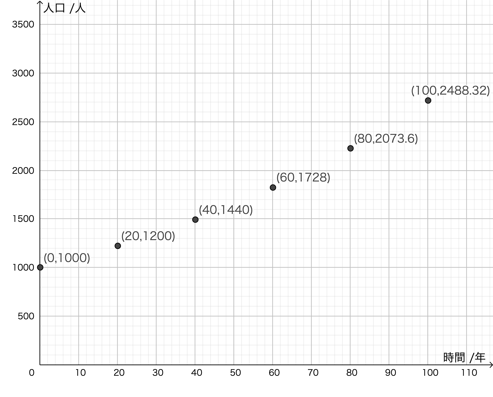
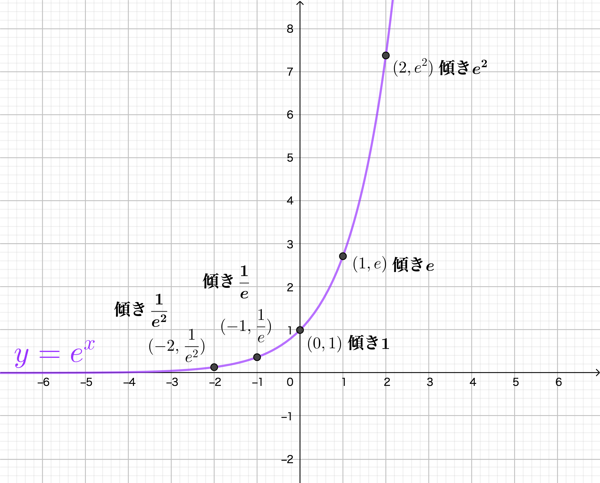

# 一般的な指数関数的減衰の関係からニュートンの冷却則を導く

本項では、指数関数的に減衰する現象について学習する。指数関数的減衰が起きている事例から、それを引き起こす原因となる関係（つまり関数）を見出し、ある一定の環境に置かれた高温物体が時間に伴い冷却していく過程が、それと同様であることを示す。数学において学ぶ指数関数・対数関数がどのように私たちのまわりにあるものか、体感してほしい。

微分方程式でこの問題を解くやり方も含め、掲載する。やる気のある者には、是非チャレンジしてもらいたい。

## 指数関数的な変化をしている様々なもの・こと

私たちのまわりには、指数関数的変化をするものが、たくさんある。

### 指数関数的増加 (Exponential growth)

バクテリアやウィルスなどの自己増殖する生物の数

核分裂連鎖反応

複利

ネズミ講

### 指数関数的減衰 (Exponential decay)

空気抵抗を受ける物体の落下速度

一定の環境に置かれた高温物体の冷却過程における温度

充電中のコンデンサの端子間電圧

放射性元素の崩壊

などなど。

## 指数関数的変化をするものに共通する法則は何なのか

では、そのような変化を起こす原因になっている関数、法則は何だろうか。考えてみよう。

例えば、人口1000人の村があったとする。この時から20年後、村の人口は1200人になった。では、さらに20年後、村の人口は何人になっていると考えられるだろう。1400人ではないことは、直感的に分かるはずだ。何故なら、20年間で生まれた200人もまた、次の20年間の人口増加に関わることになるだろうからである。

つまり、「村の人口は20年で、もとの20％増加する」と考えるのが妥当だろう。つまり、最初の20年で $1000 \times 1.20=1200$ と人口増加したなら、次の20年間で $1200 \times 1.20 = 1440$ と、1440人になるはずだ。つまり、20年で1.20を1回かけ算すると、その時の人口を求められることになる。

このことをまとめると、**人口が増加する勢いは、その時その時の人口に比例している**ことにより、人口は時間に対して指数関数的に成長していると言えるだろう。しかしこれでは20年ごとの人口しかわからない。だが……

## その関係を式に表すためには……

改めて、最初に列挙した「指数関数的な変化をしている様々なもの・こと」を考えてみよう。全て、**その量の変化の割合が、その時のその量の大きさに比例する**という共通のルールがあることに気付く。これを式に表すためには、どうしても微分の助けを借りる必要があるし、これを解くためには、ごく基本的なものとは言え、微分方程式を解く必要がある。以下、心してかかろう。

ある時間変化する量 $N$ がある。この量の時間変化の割合は、$N$ の $t$ による1階微分で表される。これが $N$ と比例することは、以下のような式で表される。
$$
\frac{dN}{dt}=\lambda N
$$
あるいは、$N'=\lambda N$ 、$\dot{N}=\lambda N$ でも同様の意味になる。ただしこれらの記法は、表されたものが $t$ による微分であることが文脈から明らかでないといけないことに注意するべきである。

## $\frac{dN}{dt}=-\lambda N \tag{1}$ を解く

時間経過に伴い指数関数的減衰する物理量 $N$ について、 $t=0$ において$N=N_0$ であったが、ある時刻 $t$ において $N$ であったとする。 $N$ と、$N$ の1次導関数が比例するなら、減衰であるから負の係数 $-\lambda$ を用いて
$$
\frac{dN}{dt}=-\lambda N
$$
と表せる。 $N$ を変数分離して
$$
\frac{1}{N}dN=-\lambda dt
$$
両辺を定積分する。$t=0$ において$N=N_0$ であるから、
$$
\int^N_{N_0}\frac{1}{N}dN=-\lambda\int^t_0 dt
$$
左辺について解く。積分公式 $\int\frac{1}{x}dx=\log_{e}x+C$ を利用できる。
$$
\int^N_{N_0}\frac{1}NdN=\left[\log_{e}N\right]^{N}_{N_0}=(\log_{e}N-\log_{e}N_0)=\log_{e}\frac{N}{N_0}
$$
であるから、(3)式は、
$$
\log_{e}\frac{N}{N_0}=-\lambda t
$$
指数関数の形で書き直すと
$$
\frac{N}{N_0}=e^{-\lambda t}
$$

$N$ について整理して
$$
N=N_0e^{-\lambda t}
$$
上式が、物理量 $N$ が時間経過により指数関数的減衰をする場合の一般式である。

せっかくなので、この式に従って、先ほどの「1000人の村問題」も考えてみよう。下図のようになる。

## $e$ ってなんだ！ 

（正直、$e$ については数学の先生に教わった方が絶対にいいのだが……最低限の説明を、ここでする。）

なんか突然 $e$ という文字が現れたが、これはネイピア数と呼ばれる数学定数である。（物理定数ではない。）
$$
e=2.71828182845904523536...
$$
微分積分学で重要な意味を持つ定数であり、 $y=e^x$ をグラフに表すと、全ての $x$ における $y$ の値が、その $x$ における傾き $\frac{dy}{dx}$に等しくなるという性質がある。

オイラーの定義によると、$\frac{d}{dx}a^x=a^x$ であるとき、$a=e$ である。よって、
$$
\frac{d}{dx}e^x=e^x
$$
である。つまり、$y=e^x$ であるとき、 $\frac{dy}{dx}=e^x$ であり、**$y$ の変化の割合が、その $x$ に対する $y$ の値と同じ値になる。** 

確か指数関数的変化をする値は、**その量の変化の割合が、その時のその量の大きさに比例する**と学んだはず。$N=N_0e^{\lambda t}$ において、$N=1, \lambda=1$ であるとき、$N=e^t$ であり、$y=e^x$ と同じ形になる。底を $e$ とすることで、指数関数を最もすっきりと表現できる。

ネイピア数に関するWebページや書籍はたくさんある。たくさんの情報を吸収し、数学の授業もよく聞いて、なんでそんなに重要な数値なのか、何がそんなに面白いのかを見出して欲しい。

## ニュートンの冷却則を $\frac{dN}{dt}=-\lambda N$ の一般解によって表す

さて、（それなりに）高温の物体を一定の環境……温度が一定の室内においた時の温度変化について考える。時刻 $t$ における高温物体の温度を $T$ とし、$t=0$ において $T=T_0$ であったとしよう（初期条件）。また、室温 $T_m$ は一定であったとする。

この時、高温物体と室温の温度差は $T-T_m$ であり、これが $t=0$ においては $T_0-T_m$ であったはずである。

ニュートンの冷却則によると、高温物体が熱を失う勢いは、その時の温度差の大きさに比例するとある。熱容量や比熱の法則を踏まえると、高温物体と室温の温度差が減少する勢いは、その時の温度差に比例すると言える。式で表すなら、
$$
\frac{d(T-T_m)}{dt}=-\lambda(T-T_m)
$$
である。この関数は、(1)式に $N=T-T_m$ を代入したものになっている、(7) に同様に代入することで、
$$
T-T_m=(T_0-T_m)e^{-\lambda t}
$$
と表せる。このことより、ニュートンの冷却則に従って物体の温度が変化するとき、室温との温度差が指数関数的に減衰するよう変化することがわかる。

## きちんとガチで解く場合

上記のやり方は、少しズルい解法かもしれない。$\frac{dN}{dt}=-\lambda N \tag{1}$ の解法を知っていないとできないだろうと言われれば、確かにそうである。また、上記の方法では $(T-T_m)$ と時間の関数を表すことで楽をしているが、実際には $t$ と $T$ の関係で表されるべきなのは言うまでもない。(11)式をあえて言葉で表すなら、
$$
(高温物体と室温の差の時間変化)=-\lambda(高温物体と室温の差の時間変化)
$$
であるが、実際にはまず
$$
(高温物体の温度の時間変化)=-\lambda(高温物体と室温の差の時間変化)
$$
のように考えられるべき問題のはずだ。結論から言えば、もちろんこのように考えても同様に一般解を導出できる。上記を改めて数式で表現するなら、
$$
\frac{dT}{dt}=-\lambda(T-T_m)
$$
である。ここから、同様に(9)式を導いてみよう。そのためには、(1)〜(7)でやった変数分離型の微分方程式の解き方と併せて、置換積分法を用いる必要がある。まずは(10)式を変数分離して
$$
\frac{1}{T-T_{m}}dT=-\lambda dt
$$
両辺を定積分すると、$t=0$ のとき $T=T_0$ であるから、
$$
\int^T_{T_0}\frac{1}{T-T_m}dT=-\lambda\int^t_0 dt
$$
である。ここで、
$$
T-T_m=W
$$
として置換積分法を利用する。上の(17)式より、
$$
\frac{dT}{dW}=\frac{d}{dW}(W+T_m)=1
$$
であるから、
$$
dT=dW
$$
である。また、積分区間について $T=T_0$ であるとき、$W=T_0-T_m$ であるので、(17)、(19)式を用いて、(16)の左辺を
$$
\int^T_{T_0}\frac{1}{T-T_m}dT=\int^{T-T_m}_{T_0-T_m}\frac{1}{W}dW
$$
と置換できる。これを、積分公式を用いて解くと
$$
\int^{T-T_m}_{T_0-T_m}\frac{1}{W}dW=\left[\log_{e}W\right]^{T-T_m}_{T_0-T_m}=\log_{e}(T-T_m)-\log_{e}(T_0-T_m)=\log_{e}\frac{T-T_m}{T_0-T_m}
$$
であるから、改めて(16)式は
$$
\log_{e}\frac{T-T_m}{T_0-T_m}=-\lambda t
$$
と表せる。これを指数関数の形に書き直すと
$$
\frac{T-T_m}{T_0-T_m}=e^{-\lambda t}
$$
であり、両辺に $T_0-T_m$ をかけることで
$$
T-T_m=(T_0-T_m)e^{-\lambda t}
$$
となる。これは(12)式と同じである。

