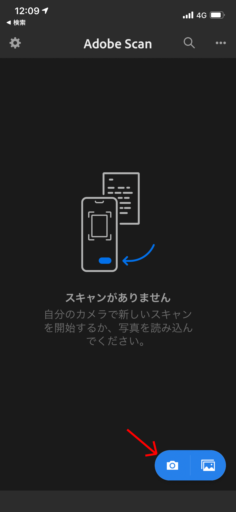
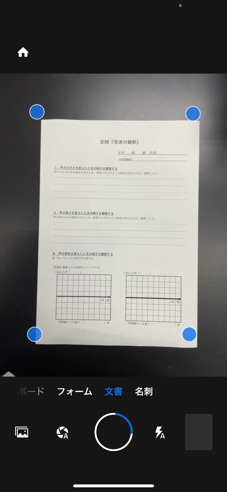
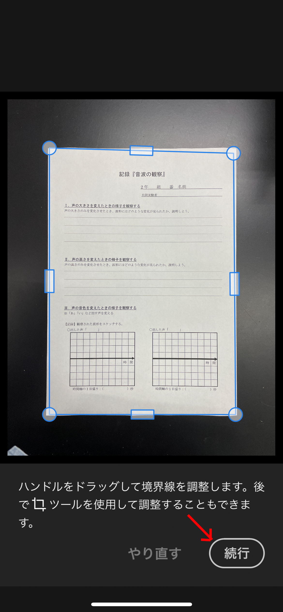
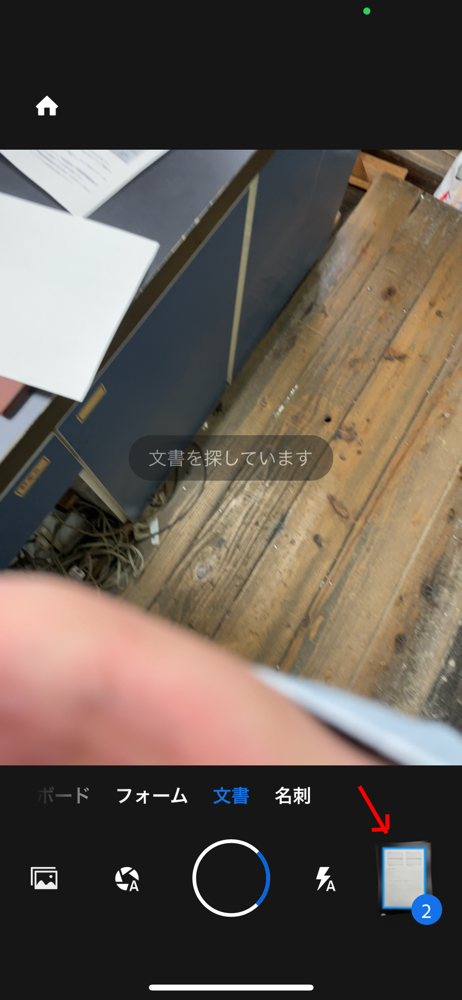
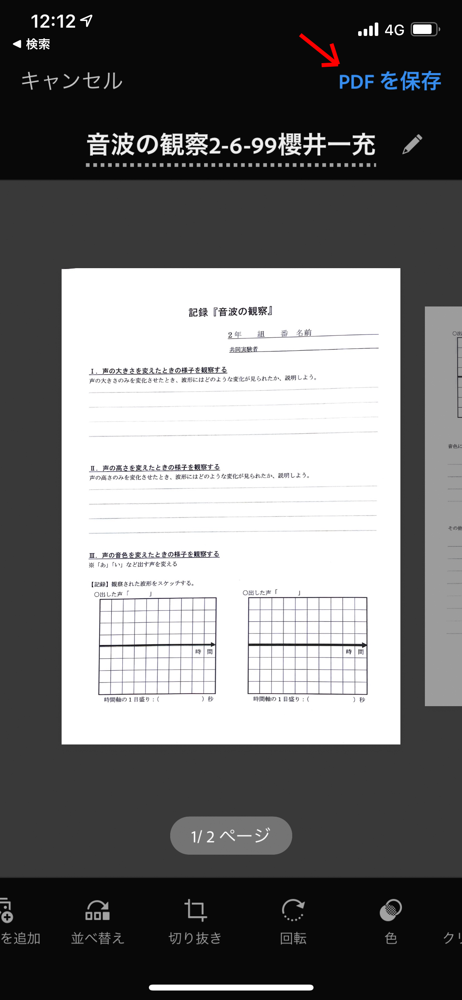
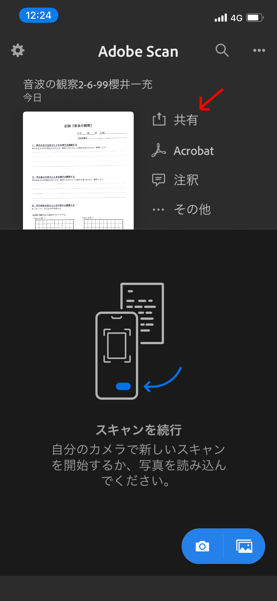
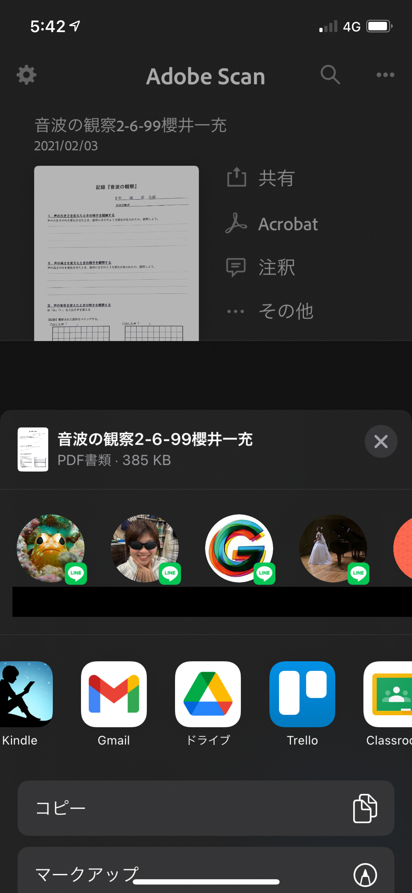
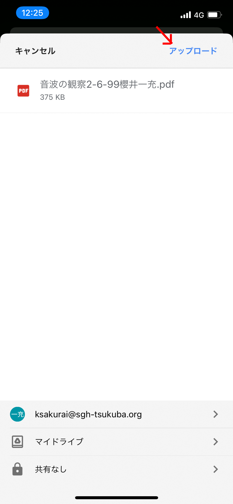

# 手書き文書をPDF形式で課題提出するやり方

スマートフォンを利用して、手書き文書を課題提出する方法を紹介します。

基本的な方針は

1. スマートフォンのスキャンアプリを使用して手書き文書をスキャン
2. アプリ内でPDF形式を指定し、Google ドライブに送る
3. Classroomの課題ページからドライブに保存した文書を提出

の順番です。ここで紹介する方法以外でも、上記の手順でやれば大抵うまくいくし、他に慣れた方法があるならば、そのやり方で構わないと思います。

　ここでは、私もよく利用している、Adobe Scanというスキャンアプリを使用する方法を示します。このアプリはスキャンした文書をAdobe Document Cloudというクラウドストレージに自動的に保存するものです。サービスへのサインアップが必要であることや、文書はクラウド上に保存されることもあり、全くリスクのない方法ではないことを承知の上、利用するようにしてください。（Adobe社のストレージにおけるセキュリティリスクは低いはずです。）

## Adobe Scanで手書き書類をスキャンしてGoogle ドライブに送る方法

1. まずAdobe ScanおよびGoogle ドライブをインストールし、初回起動とログイン・サインアップ等を行う。（Google ドライブは、特にこだわりがなければ学校でもらったアカウントと紐付けておくとスムーズ。）

2. スキャンする文書を手元に用意し、平らで白くない机の上などに置く。
   （文書の自動認識がはたらくように）
   
3. ホーム画面になったら、右下の青いカメラのボタンを押す。

   

   

4. カメラが起動するので、文書全体が映るようにカメラを動かす。文書が正しく認識されると、自動的に撮影される。

   

   

5. 文書の境界が正しく指定されているのを確認し、続行を押す。

   

   

6. カメラ画面に戻るので、全てのページをスキャンするまで、4，5を繰り返す。

7. 全ページのスキャンか完了したら、右下のスキャン済み文書アイコンを押す。

   

   

8. 保存画面に移るので、必要であれば名前を変更し、右上の「PDFを保存」を押す。

   

   

9. 文書は自動的にAdobe Document Cloudに保存され、ホーム画面に現れるので、共有ボタンを押す。

   

   

10. 「コピーを共有」を選択。

11. 送り先やサービスを選択するダイアログに移動するので、「Google ドライブ」を選択。（一覧になければ「その他」を選択して、そこからGoogle ドライブを選ぶ。）

    

    

12. Google ドライブの保存先指定画面に移るので、保存先を確認し、アップロードを押す。

    

    

13. これで自分のGoogle ドライブに文書が保存されているので、Classroomからアップロードする際にGoogle ドライブから文書を提出できる。

