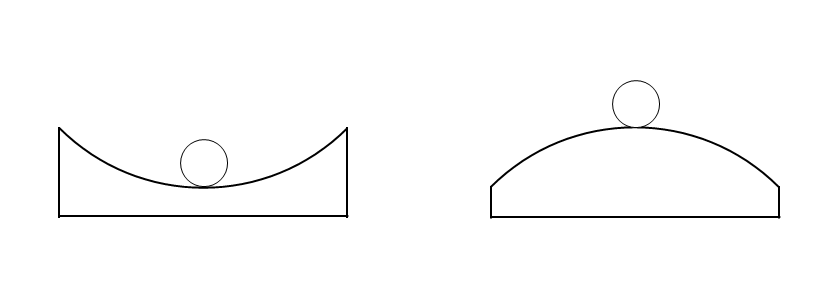

# 振動（波動の学習の前に）

　本テキストは、高校物理における波動に関する学習をはじめる前に取り組むべき、振動についての基本的な学習事項を取りまとめたものである。日本の高校物理の教科書における振動現象の取り扱いは、4単位物理における単振動でほぼ全てであるが、海外で使われている物理の教科書には、波動の前に振動について細かく書かれているものも多くある。ここでは、波動の学習前に確認しておくべき項目に絞って取り上げていく。

## 安定と不安定

　なめらかな球状の器壁をもった容器（時計皿でもボウルでも、茶碗でもよい）の上に、小さな金属球を置いたときのことを考察してみよう。図に示したように、凹面を上にした場合と凸面を上にした場合の2通りを考える。

　金属球にはたらく力は重力と器壁から受ける垂直抗力の2つである。作図すると、凸面が上だろうと凹面が上だろうと、金属球にはたらく力はつり合い、静止し続けると考えられる……。

　しかし、実際に同様の実験を試みると、凹面が上の場合と凸面が上の場合で、観察される現象は異なる。前者では容器の上に金属球が留まるが、後者ではつるつると滑り落ちてしまい、器の上に金属球を保持し続けることが極めて難しいことがわかるだろう。この違いは、どのように説明できるだろうか？

　実際に図2に示した状態で金属球が静止し続けるためには、次に示すような厳しい条件があることに気付く。

- 容器が精巧に作られた対称な形である
- 金属球を寸分の狂い無く中央に置く
- 空気や地面の動きや揺れを含めた、一切の外力を受けない

　この条件を満たす（満たし続ける）ことが難しい以上、金属球が中央からいくらか移動した場合にどう振る舞うのかについても気を配るべきであることがわかる。その様子を図に表すと、違いが明らかになってくる。

図3

　凹面上の金属球は中央からずれた位置にあるとき、中央にもどる向きに力がはたらく。一方で、中央からずれた凸面上の金属球は、そのずれが拡大していく方向に力がはたらく。その結果、前者では中央からのずれが拡大せず、金属球は容器の上に留まるが、後者では少しでもずれるとそれが拡大されていくため、容器上に金属球が留まること自体が難しい。私たちは日常生活の中で、このような2つの違いを「安定している」「不安定である」という短い言い回しで区別している。

## 安定した状態をつくる力１：摩擦力

　摩擦力はその性質により、物体を安定してその場に静止させていることが多い。物体が最大摩擦力を超えない範囲での外力を受けても、物体は与えられた外力に対して同じ大きさで逆向きの静止摩擦力を接触面から受け、物体は静止し続    けるからである。

## 安定した状態をつくる力２：復元力（広義）

　例示した凹面上の金属球は、つり合いの中心が存在し、その場所から移動した時につり合いの中心に戻る向きに力がはたらく構造を持つ。このようにはたらく力を復元力といい、復元力がはたらく物体や系では、それらが多少つり合いの位置からずれようとも、ずれはその範囲内に留まり続け、物体や系が持つ力学的エネルギーが散逸しない限り、物体は周期的な運動……すなわち振動を続ける。剛体の場合は、重心が支点よりも下にある場合に回転方向への安定が得られ、やじろべえのように姿勢を安定させることができる。

　以上から、物体や系の振動は、復元力がはたらくことによって生じる現象だと言えるだろう。私たちは自然現象の中に、たくさんの振動を見つけることができる。（風に揺れる木、波に揺らされる船、振り子やメトロノーム、ばねのおもちゃ……）多くの場合、そこに復元力がはたらく構造を見出すことができるはずだ。

## 復元力（狭義）と単振動

　例えばおもりをばねにつるして、それを持ち上げるか引っぱるかして手を放すと、おもりは振動する。ばねにつるされたおもりが受ける復元力の大きさは、つり合いの中心からの距離に比例している。高校物理では、復元力の大きさがつり合いの中心からの距離に比例する場合（ばね振り子・単振り子）についてよく取り扱い、この力を特に復元力と呼称することが多い。（以後、本テキストではこれを復元力（狭義）と記す。）

　復元力（狭義） $\overrightarrow{F}$ は、以下のように表せる。

$$
\overrightarrow{F}=-K\overrightarrow{x}
$$

　このような力がはたらく場合、つりあいの中心からの変位は、時間経過に伴い三角関数に従った位置変化をする。（……なんでそこでいきなり三角関数が出てくるのかについては補足を参照。）このような振動を単振動という。

## 単振動を表現する

　さて、同じ単振動であっても、動きの大小・リズムの速い遅いなどによる違いが生じうる。ばね振り子を作ったのなら、どれだけ引っぱって離すかによって振動の大きさを、おもりの質量やばねのかたさを変更することで振動のリズムの速さを変えることができる。

## 振動と波動

　力を及ぼし合う構造が空間に分布しているとき、その中のある一点が外力によって動かされたり、振動させられるとき、その動きが次々に隣に伝わっていき、空間を移動していくのが観察できる。このような現象を波、または波動という。物理学において、振動とそれが伝播することで生じる波動を理解することは、種々の振動現象のみならず、音や光のふるまいを理解することに繋がることもあり、極めて重要である。

## 波動現象は力学的（機械的）なものだけじゃない

　ここでは力学から振動・波動につながる現象を明らかにしていったため、力学的な振動や波動について取り扱った。

## まとめると

## 補足

補足事項について、以下にまとめた。

### 安定した状態をつくる力3（？）：フィードバック制御

　私たち人間は支点（足下）に対して重心がずいぶん上にあるのに、2つの足で立ち、歩き、そうしながら様々なことをやっている。私たちが様々な外乱の影響を受けても頑健（ロバスト）に直立し続けられるのは、ずっと無意識のうちに自分の体勢を感じ取り、より安定した位置に重心が移動するよう姿勢を制御し続けているからであろう。現在の状態を読み取って、ある目標からのずれが小さくなるように制御することをフィードバック制御といい、力学的なフィードバック制御を利用することで、復元力が支配的でない物体や系であっても安定させることができる。

　フィードバック制御を扱う制御工学においては、目標の状態から行き過ぎを繰り返して振動し続ける状態も不安定性の1つとして考え、その振動を目標値±許容範囲の中に収まるよう逓減させるのも、大事なことである。

- 安定という言葉の定義や示すところは、状況や学問によって異なるから注意してね。

### なんでそこで三角関数が出てくるのか

　それをきちんと説明するためには、二階線形微分方程式（少なくとも同次形）を解くことができないといけない。できるだけ平易に説明するならば……。

