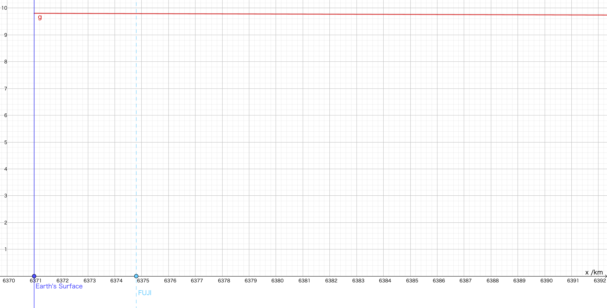
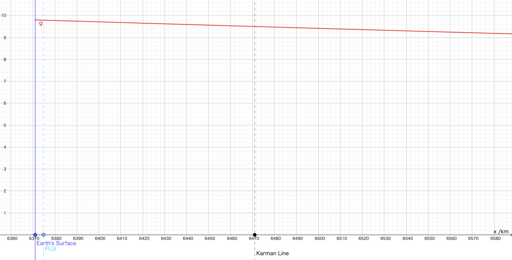
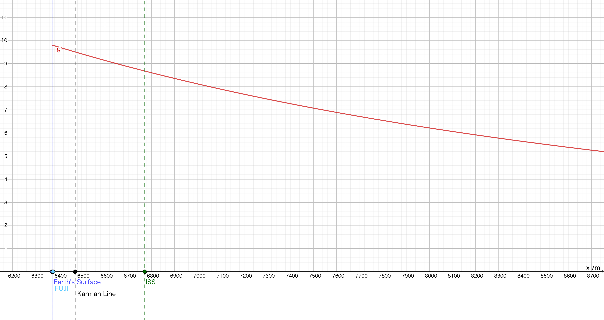
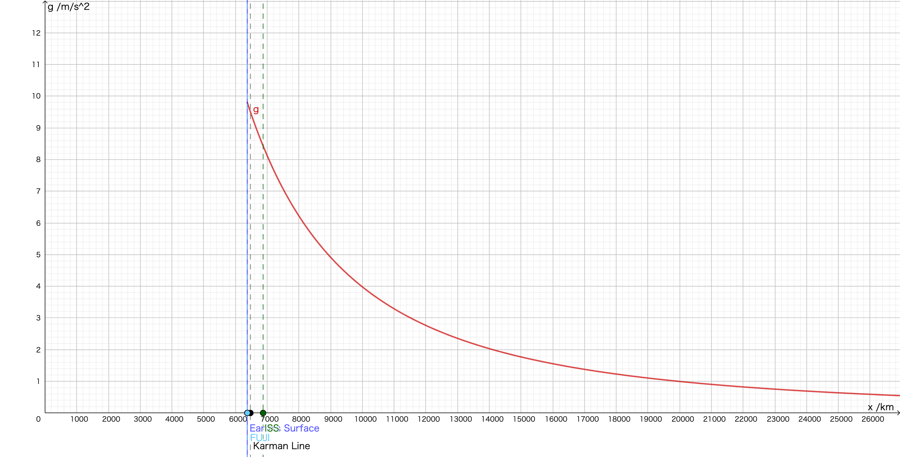
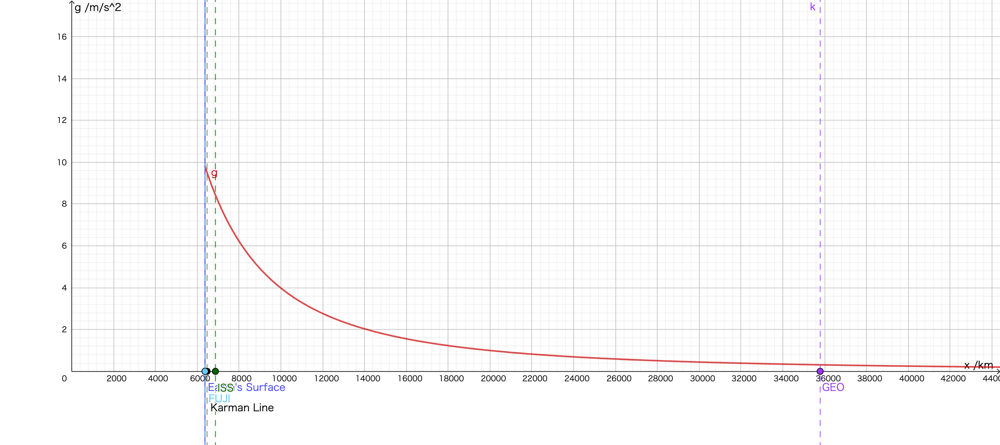
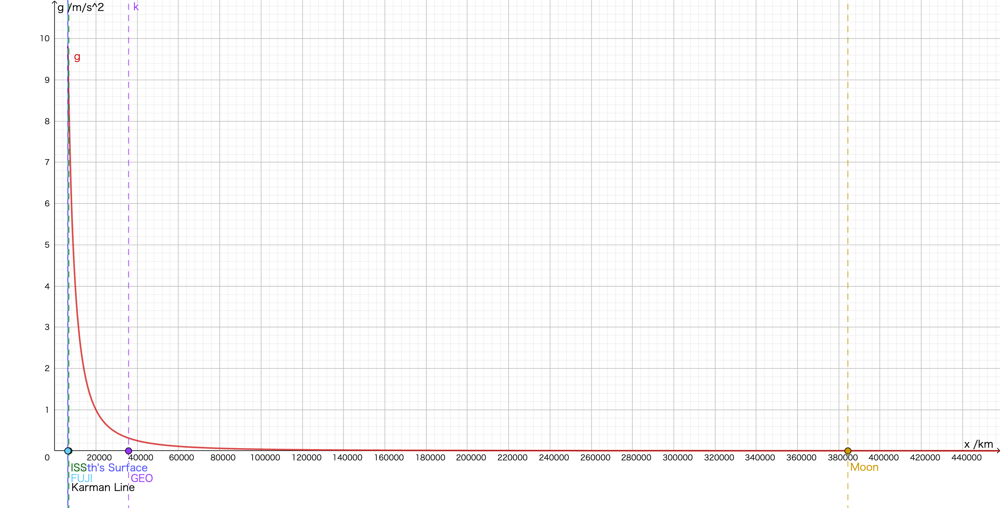
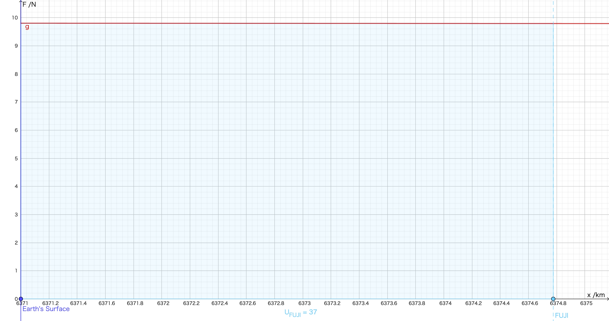
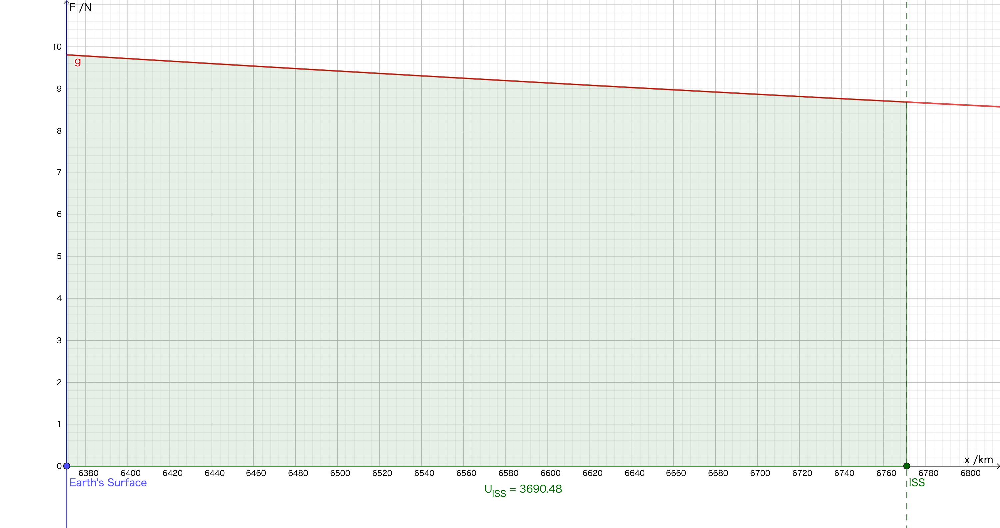
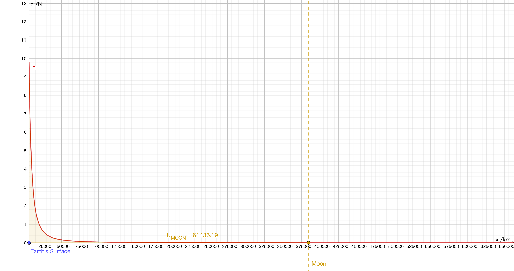

# エネルギー 第4回 仕事とエネルギー③ 位置エネルギー・振り子と力学的エネルギー保存（分析）質問等回答

#### この世の全ての物体をとりあえずこの式に当てはめることが出来るのが、世界を理解した気になれてうれしい

世界を理解することを楽しいと感じるなら、まだまだ先があるので楽しみ放題です。物理学の中でも、特に素粒子物理学や統一理論は、まさに「世界を理解する」ことを目的とした学問と言えるかもしれません。

#### 力学的エネルギー保存の法則や位置エネルギー、運動エネルギーについては中学生の時にも習っていますが、具体的な数式であらわしたりしたことはなかったためしっかり復習をして計算ができるようにしたい。

計算できることは、確かに大事です。計算できるから定量的に考えることができるとも言えます。私もここ最近、Geogebraを使って式を手軽にグラフ化できるようになって、ちょこっと計算して、グラフを作ってみることが大分楽しくなりました。

#### すごく分かりやすい理論で初めに見つけた人は凄いと思った

ヤングの実験でも有名な、トーマス・ヤングさんが、初めてエネルギーの概念を導入したと言われています。彼もまた多才な人で、多くの分野で功績を挙げている人です。

#### この授業を休んでいて、授業で何を言われていたのかはわからないが、スライドを見る限り、力学的エネルギーは身近なところにたくさん使われているような気がした。運動エネルギーは納得できるが、位置エネルギーは何故ある高さの場所にあるだけなのにエネルギーが発生するのだろうと思ったが、よくよく考えてみたら高いところから物体を落とすのは水平面での等加速度直線運動と同じことなのでエネルギーが生まれるのは当然なのかなと思った。

エネルギーは、その物体がどのような状態にあるかのみによって決定される「状態量」であり、他の物体に仕事ができる量を示す「ストック」であることが概念的に理解できれば、OKです。

#### 力学的エネルギーの保存は空気抵抗などでエネルギーが使われて実験で確かめるのがとても難しいと思うのですが保存されることはどうやって証明するのでしょうか。空気抵抗などで失われるエネルギーを全て漏れなく計算することは不可能だと思いました。

さしあたって学校の実験においては、与えられた装置で実施した実験で示されるレベルで、精密な実験ができていれば十分です。もちろん、装置を改善すればより精密に結果を出すことができるかもしれませんね。今回の実験であれば、振り子の支点で生じる摩擦が小さい方がよいし、おもりが重いほうが空気抵抗の影響で運動の様子が変化しにくくなるので、支点をナイフエッジにし、糸を伸びにくい鋼線にし、おもりを重くすればよりよい結果が出るかもしれません。一方で、非保存力により失われるエネルギーがゼロになるわけではありませんから、精度が無限大になるわけではないのです。

ですから、最後の一歩はどうしても「こうではないか」という推測になるし、それでよい。科学は「できるだけ」自然科学を正しく記述しようとした人々の積み重ねの結果としてあるものです。それゆえ、あらゆる科学的知識は完全で無い可能性があり、修正される可能性があることを理解しておくのは、正しい理解と言えましょう。

……もしも、もしもですよ。あなたがこの世からごく僅かに「失われているエネルギー」を発見して、再現可能な実験で示すことができたなら、その時にはエネルギー保存則は「書き換わる」「修正される」ということです。

この文書の最後に、ある英語の教科書の和訳（抜粋）を掲載しました。関連することなので、一読してみてください。

#### たとえば、高度が滅茶苦茶に高い地点では、直感的には重力が変化しそうですが、じっさいどうなんでしょうか？ 更に高度が高くなり宇宙に飛び出し、重力がほとんど及ばなくなった時、U=mghの式で考えると、この物体はとても大きな位置エネルギーを持っていることになるがこの物体が地上に落下して仕事をするとは思えないので、どうかんがえればよいのか、わかりません。

とてもよい疑問だと思います。

高度が変われば、確かに重力が変化します。ですが、私たちが「重力加速度は $g$ である」と一定値であるとしている限り、高度による重力の変化は考慮していないことになります。ですから「重力加速度は $g$ である」としている物理モデルで正しく表せるのは、地表面付近の、私たちが見るスケールの物理現象のみということになります。**今考えているモデルは、どの範囲で通用するのか？**というのは、科学的に考える上でとても重要なことです。

重力加速度が定数 $g$ であると仮定することは、物体に重力 $W=mg$ がはたらくと仮定することと同じですが……実際には地球と物体が引き合う力の大きさは、「2物体の質量の積に比例し、距離の2乗に反比例する」という**万有引力の法則**に従います。即ち、万有引力定数 $G=6.67\times10^{-11}\;\mathrm{m^3/(kg\cdot s^2)}$ を用いて、
$$
W=G\frac{mM}{r^2}
$$
で表されます。地球と物体の中心距離まで含めて $g$ の値を決めるなら、
$$
W=mg=m\cdot\frac{GM}{r^2}\;より\;g=\frac{GM}{r^2}
$$
ということになります。地球の質量 $M=5.97\times10^{24} \;\mathrm{kg}$ と万有引力定数 $G$ を用いて、$g$ と$r$ の関係をグラフで表してみます。地球の平均半径は $6371\;\mathrm{km}$ ですから、上式を代入して、横軸を地球の中心からの距離 $x\;\mathrm{/m}$ 、縦軸を $g\;\mathrm{/(m/s^2)}$ として、横軸の比率を変えながらグラフを見てみましょう。このグラフは、その位置における重力加速度を表すとともに、 $1\,\mathrm{kg}$ の物体にはたらく引力の大きさを表すグラフと同じ形状になります。

まずは、縦軸 $1\;\mathrm{m/s^2}$ と横軸 $1\;\mathrm{km}$ を同じ長さにして $g-x$ グラフを書くと……

水色のラインは、富士山の山頂です。重力加速度は概ね $9.8\;\mathrm{m/s^2}$ であり、この範囲で大きく変わっているようすはありませんね。このグラフでは、横軸の一番小さな1目盛りが $200\;\mathrm{m}$ です。

縦軸に対して横軸を10倍縮めてみると、縦軸 $1\;\mathrm{m/s^2}$ と横軸 $10\;\mathrm{km}$ を揃えたグラフになります。そうすると……

上空 $100\;\mathrm{km}$ のカーマン・ラインが見えています。「地球と宇宙の境目なんてないけど、議論の便宜上ここから先を宇宙ってことにしておこう」のラインです。大気圏の分類で言うと、もう熱圏の範囲です。

さらに10倍縮めて、縦軸 $1\;\mathrm{m/s^2}$ と横軸 $100\;\mathrm{km}$ を揃えると……

だいぶ重力加速度の減少が顕著になってきました。緑色のラインはISSのある高度 $400\;\mathrm{km}$ です。（一般的に $400\;\mathrm{km}$ と言われるのでその値を採用しましたが、ISSは空気抵抗により減速しますから、徐々に高度を下げることになります。高度が下がると、一定の高さを保つためのリブーストが行われます。ISSはずっと同じ高さにあるわけではないことに注意しましょう。）このグラフから見て分かるとおり、**ISSにはおよそ $8.43\;\mathrm{m/s^2}$ の重力加速度がはたらいています。** 一方で、ISS内の映像を見ると、どう見ても全て無重力のふるまいをしているように見えます。それは何故か、説明できますか？

さらに10倍縮めると、縦軸 $1\;\mathrm{m/s^2}$ と横軸 $1000\;\mathrm{km}$ を揃えることになります……

原点を含めたグラフにしてみました。x軸について、原点から青線 $(6371\;\mathrm{m})$ までの長さが、地球の半径です。上空 $20000\;\mathrm{km}$ あたりを境に、重力加速度は $1\;\mathrm{m/s^2}$ を下回るようですね。ここから少しだけグラフをズームアウトすると……

紫のラインは、静止衛星軌道（geosynchronous equatorial orbit = GEO）です。気象衛星ひまわりなどの、静止衛星のある高さはこのくらいです。

最後に、一気に進めて縦軸 $1\;\mathrm{m/s^2}$ と横軸 $20000\;\mathrm{km}$ を揃えると……

月と地球の中心距離は $384400\;\mathrm{km}$ と言われています。そこに至ると、重力加速度はかなり小さくなることがわかります。

さて、その際の位置エネルギーはどうなるのでしょうか。位置エネルギーは「重力に逆らってした仕事」の分だけ増加するのは、説明した通りです。そして高さによって重力の大きさが変化するならば、高い場所ほど逆らうべき重力が小さく、同じだけ上昇しても位置エネルギーの増加は穏やかになります。グラフで示すなら、縦軸を重力 $F$ として $F-x$ グラフを書いたときに、$x$ に対して $g$ が掃く符号付き面積に等しくなります。

 $1\,\mathrm{kg}$ の物体にはたらく引力の大きさを表す $F-x$ グラフは、これまでに示した $g-x$ グラフと同じ形になりますから、地表面の高さを基準として、 $1\,\mathrm{kg}$ の物体が富士山頂にある場合の位置エネルギーを示すと……

水色の面積にあたります。長さの単位が $\mathrm{km}$ なので、それを直すと $3.7\times 10^4\;\mathrm{J}$ です。重力加速度 $g=9.8\;\mathrm{m/s^2}$ として計算すると
$$
U_{FUJI}=mgh=1\times9.8\times3776=37004
$$
であり、ほぼ一致します。ですが、ISSの位置エネルギーは……

緑色の面積にあたります。上記は、 $1\,\mathrm{kg}$ の物体がISSの高さにある場合、 $3.69\times 10^6\;\mathrm{J}$ の位置エネルギーを保持していることを示していますが、重力加速度 $g=9.8\;\mathrm{m/s^2}$ として計算すると
$$
U_{FUJI}=mgh=1\times9.8\times400\times10^3=3.92\times10^6
$$
であり、だいぶズレが生じていることが分かります。図からも明らかですね。では、月の高さであれば……

もはや絶対に一致しないことは、計算するまでもなく明らかですね。

3年生で学習する物理を学ぶと、万有引力による位置エネルギーをきちんと定量的に表現できるようになります。興味があれば、学習を進めてみてください。

### 補遺 Pearsonの物理教科書「1.2不確実性とエラー」

以下、John Allum, Christopher Talbot (2015). Physics for the IB Diploma Second Edition. Pearson より一部を和訳抜粋

1.2不確実性とエラー

科学者は彼らの測定から「真の値」を与えることができる実験をデザインすることを目指します、しかし測定装置の限られた精度のために、彼らはしばしば何らかの形の不確実性で彼らの結果を引用します

 

自然科学「確実性」

科学者は「正確な」答えを見つける方向に向かっていると考えられていますが、測定には避けられない不確実性が存在します。すべての科学的調査の結果には不確実性と誤りがありますが、良い実験ではこれらをできるだけ小さくしようとします。私たちがあらゆる種類の（科学的またはその他の）数値データを受け取るとき、私たちが読んでいるまたは聞いているという情報にどれだけの信念を置くべきかを知る必要があります。本格的な科学的研究の結果の提示は、発見における不確実性の評価を常に有するべきです。なぜならこれは科学的プロセスの不可欠な部分だからです。残念ながら、私たちがメディアを介して受け取る情報の多くには当てはまりません。データがあまりにも多くの場合、その出所や信頼性に言及せずに、危険でも科学的でもなく提示されるのです。たとえ最善を尽くしても、たとえ最高の測定機器を使用していても、厳密に測定することは不可能です。 1つの理由で、私たちが測定できるものは完全に正確な量としては存在しません。彼らがそうする理由はありません。これはすべての測定値が近似値であることを意味します。例えば、定規の幅は2.283 891 03 cmと表示されるかもしれませんが、それでもまだ完全ではありません。それをチェックする道具。この例では、長さの測定値が非常に小さくなったときに、測定しているオブジェクトの原子的な性質に対処しなければならないという事実の複雑な問題もあります。 （原子の端はどこにありますか？）測定値の不確かさは、表示された値の上下にある範囲です。これを超えると、繰り返し測定値が低下することが予想されます。例えば、（同じ高さから）落下したときにボールが跳ね返った平均高さが48 cmであったが、実際の測定値が45 cmから51 cmの間で変動した場合、結果は48±3 cmと記録されます。不確かさは±3 cmですが、これはパーセンテージで表すほうが良い場合があり、この例では±6％です。明らかに、実験は不確実性の少ない結果を生み出すことが望ましい - そのような測定は正確であると説明されている。しかし、時には結果は正確になる可能性がありますが、間違っている可能性があります。測定値がより正確であるほど、それを表すのに使用できる有効数字（桁）の数が多くなります。数量の正しい（「真」の）値がわかっていても、それが同じではない実際の測定が行われた場合、これを実験誤差と呼びます。つまり、測定値が正しい値と正確に同じではない場合、測定値に誤差が生じます。たとえば、ある生徒がボールの跳ね返りの高さを49 cmと記録したが、ビデオ記録を注意深く観察したところ、実際には48 cmであることがわかった場合、+ 1 cmの測定には誤差がありました。すべての測定は、それらが大きいか小さいかにかかわらず、多くの理由が考えられるエラーを含みますが、それらは間違いと混同されるべきではありません。すべての測定値はある程度までは両方の種類の誤差を含みますが、誤差はランダムまたは系統的のいずれかとして説明できます（下記参照）。エラーと不確実性という言葉は、同じことを意味するために使用されることがありますが、これは既知の正しい結果を持つ実験を参照する場合にのみ当てはまります。

 

ToK Link

科学的知識は暫定的なものです

物理科学の目的の1つは、物質世界を正確に把握することです。 20世紀の物理学の1つの功績は、この目的が達成不可能であることを証明することでした。」Jacob Bronowski科学者たちは彼らの発見を本当に確信することができますか？一般に信じられているのは、科学は「事実」を扱い、大部分はそれが公正なコメントであるということですが、科学の性質についての不完全な印象も与えます。科学者たちは、普遍的な「真実」を明らかにしてきたと通常科学者が信じていることを示唆しているのであれば、その記述は誤解を招くものです。科学的知識は暫定的なものであり、私たちが新たな発見をしたときにはいつでも変更することができます。それだけでなく、既存の「知識」の再検討を促し、改善と進歩を模索することは科学と優れた科学者の本質的な性質です。