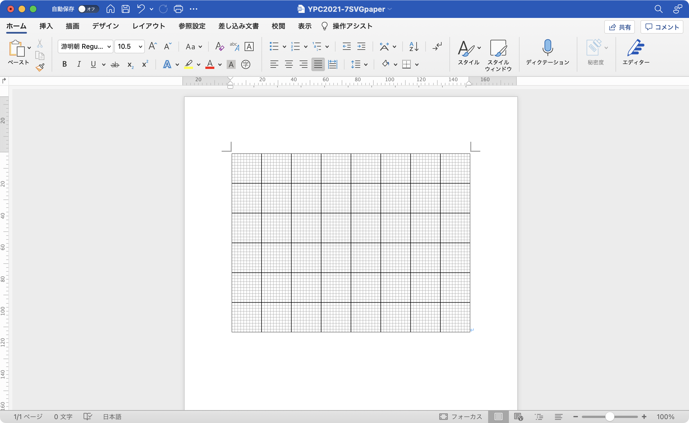
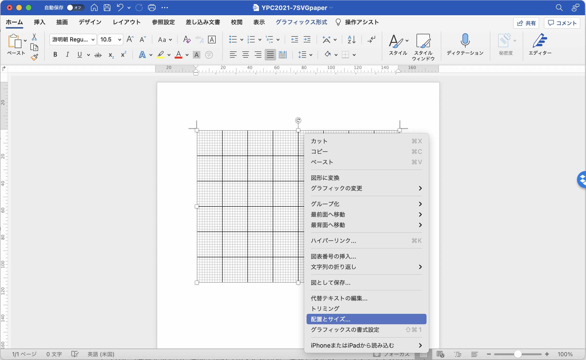
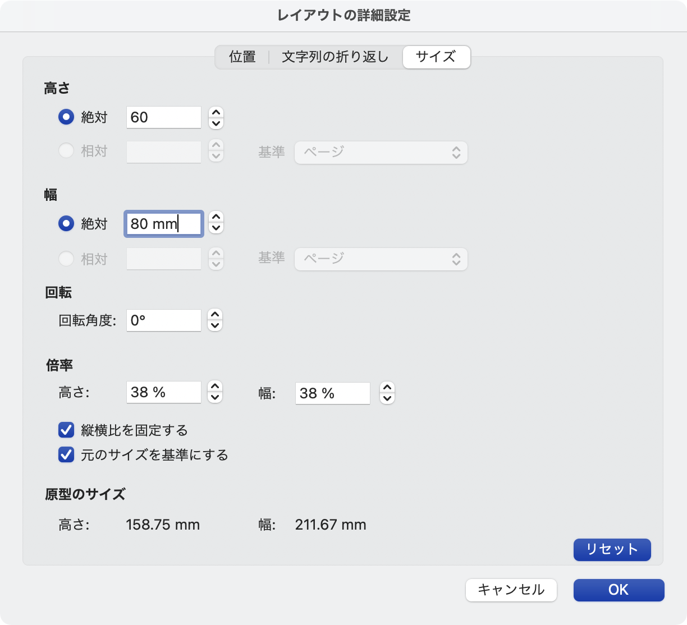
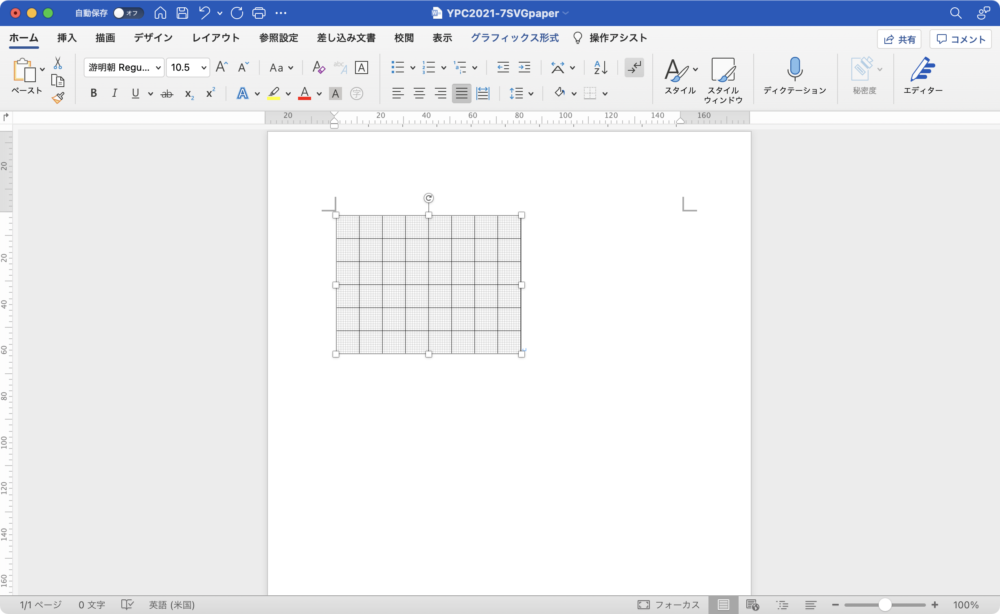

# SVG方眼紙の設定方法

　2021年7月例会で発表した、SVG形式の方眼紙の大きさなどサイズの変更方法について、簡単にまとめます。


## 元ファイルその1 "graphpaperW8H6.svg"について

　このファイルをテキストエディタで開くと、以下のようなXML形式のコードが記述されています。

```xml
<svg xmlns="http://www.w3.org/2000/svg" width="800" height="600">
  <defs>
    <pattern id="square" width="10" height="10" patternUnits="userSpaceOnUse" >
      <rect width="10" height="10" style="fill:none;stroke:#999;stroke-width:1px"/>
    </pattern>
    <pattern id="quad" width="100" height="100" patternUnits="userSpaceOnUse" >
      <rect width="100" height="100" style="stroke:#000;stroke-width:2px" fill="url(#square)"/>
    </pattern>
  </defs>
  <rect width="800" height="600" fill="url(#quad)" style="stroke:#000;stroke-width:2px"/>
</svg>
```

　このファイルをビューワやブラウザで開くと、以下のような画像が表示されます。

<svg xmlns="http://www.w3.org/2000/svg" width="800" height="600">
  <defs>
    <pattern id="square" width="10" height="10" patternUnits="userSpaceOnUse" >
      <rect width="10" height="10" style="fill:none;stroke:#999;stroke-width:1px"/>
    </pattern>
    <pattern id="quad" width="100" height="100" patternUnits="userSpaceOnUse" >
      <rect width="100" height="100" style="stroke:#000;stroke-width:2px" fill="url(#square)"/>
    </pattern>
  </defs>
  <rect width="800" height="600" fill="url(#quad)" style="stroke:#000;stroke-width:2px"/>
</svg>


## マスの数を変更するための書き換え方とその例

　この方眼マスの数を変更するには、**一番上にあるsvgタグ内の"width", "height"**と、**下から2行目のrectタグ内にある"width", "height"**を、必要な大きさに変更してください。元ファイルはこれを800x600としており、大マスが8x6になっています。

　例えば、**大マスを5x5にしたい場合、以下のようにコードを変更します。**（変更する行にコメントを入れていますが、実際に変更する際にコメントを入れる必要はありません。）

```xml
<svg xmlns="http://www.w3.org/2000/svg" width="500" height="500"> <!-- この行と -->
  <defs>
    <pattern id="square" width="10" height="10" patternUnits="userSpaceOnUse" >
      <rect width="10" height="10" style="fill:none;stroke:#999;stroke-width:1px"/>
    </pattern>
    <pattern id="quad" width="100" height="100" patternUnits="userSpaceOnUse" >
      <rect width="100" height="100" style="stroke:#000;stroke-width:2px" fill="url(#square)"/>
    </pattern>
  </defs>
  <rect width="500" height="500" fill="url(#quad)" style="stroke:#000;stroke-width:2px"/> <!-- この行 -->
</svg>
```

　すると、以下のような画像ファイルになります。

<svg xmlns="http://www.w3.org/2000/svg" width="500" height="500">
  <defs>
    <pattern id="square" width="10" height="10" patternUnits="userSpaceOnUse" >
      <rect width="10" height="10" style="fill:none;stroke:#999;stroke-width:1px"/>
    </pattern>
    <pattern id="quad" width="100" height="100" patternUnits="userSpaceOnUse" >
      <rect width="100" height="100" style="stroke:#000;stroke-width:2px" fill="url(#square)"/>
    </pattern>
  </defs>
  <rect width="500" height="500" fill="url(#quad)" style="stroke:#000;stroke-width:2px"/>
</svg>


## Wordに貼り付けてサイズを整えるやり方

　このSVGファイルは、各大きさの単位をpxで書いていますので、印刷時の大きさを考慮していません。一般的な1mm方眼と同じサイズで印刷するためには、サイズを適切に調整する必要があります。以下に一例として、大マス8x6の方眼紙である graphpaperW8H6.svg を、Word内に貼り付けて80mm x 60mm のサイズに変更する方法を説明します。


　まず、graphpaperW8H6.svg をword文書に貼り付けると、以下のようになります。




　そうしたら画像を右クリックして「配置とサイズ」を選択する。




「縦横比を固定する」にチェックマークが入っていることを確認し、高さを画像サイズに合わせて設定する。（この例では高さが6マス分なので $60\,\mathrm{mm}$​​​ ）すると幅は自動で正しい値になる。




　OKを押したらリサイズ完了です。




元ファイルその2については、取りまとめたら更新します。

