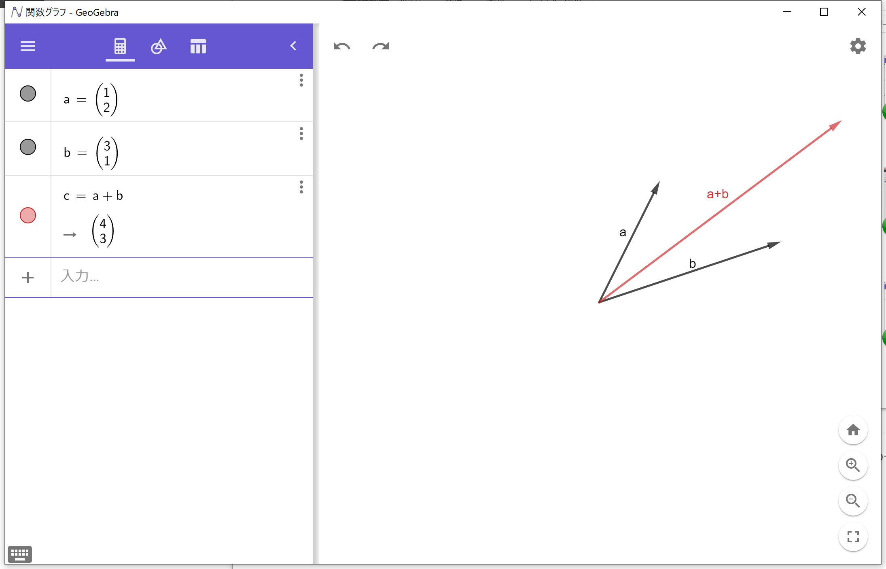
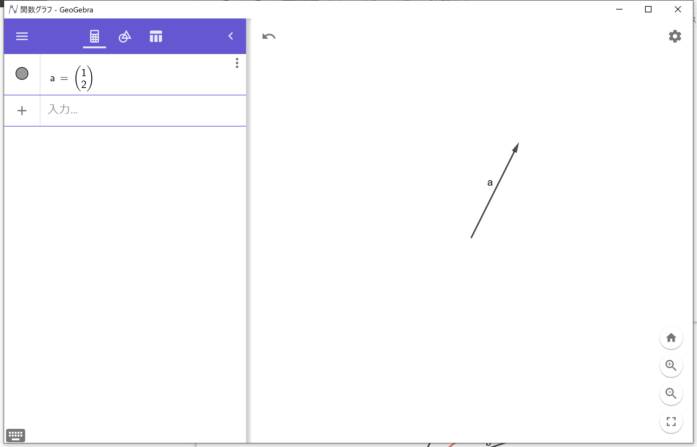
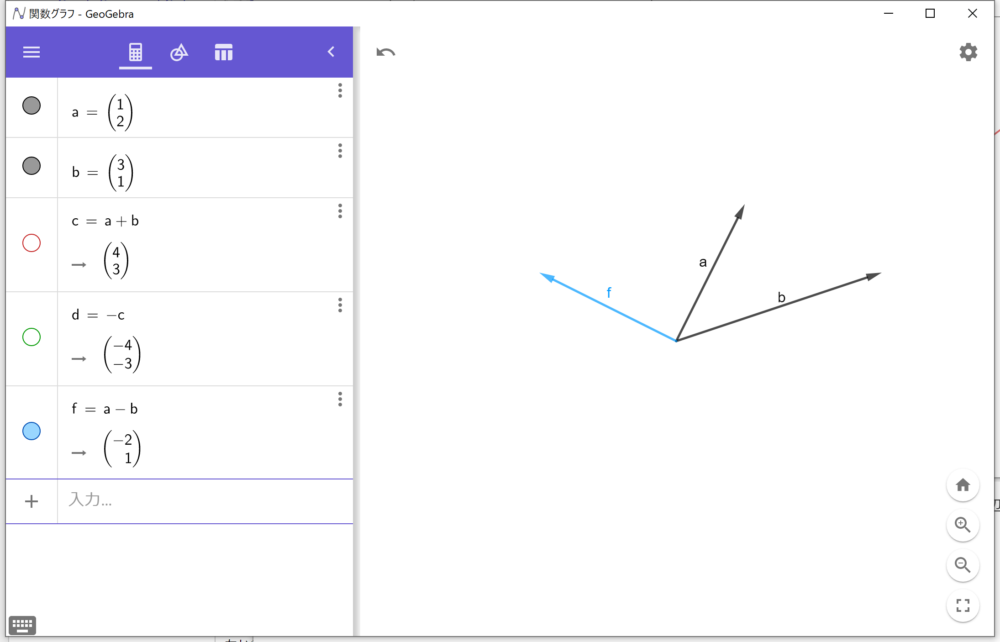
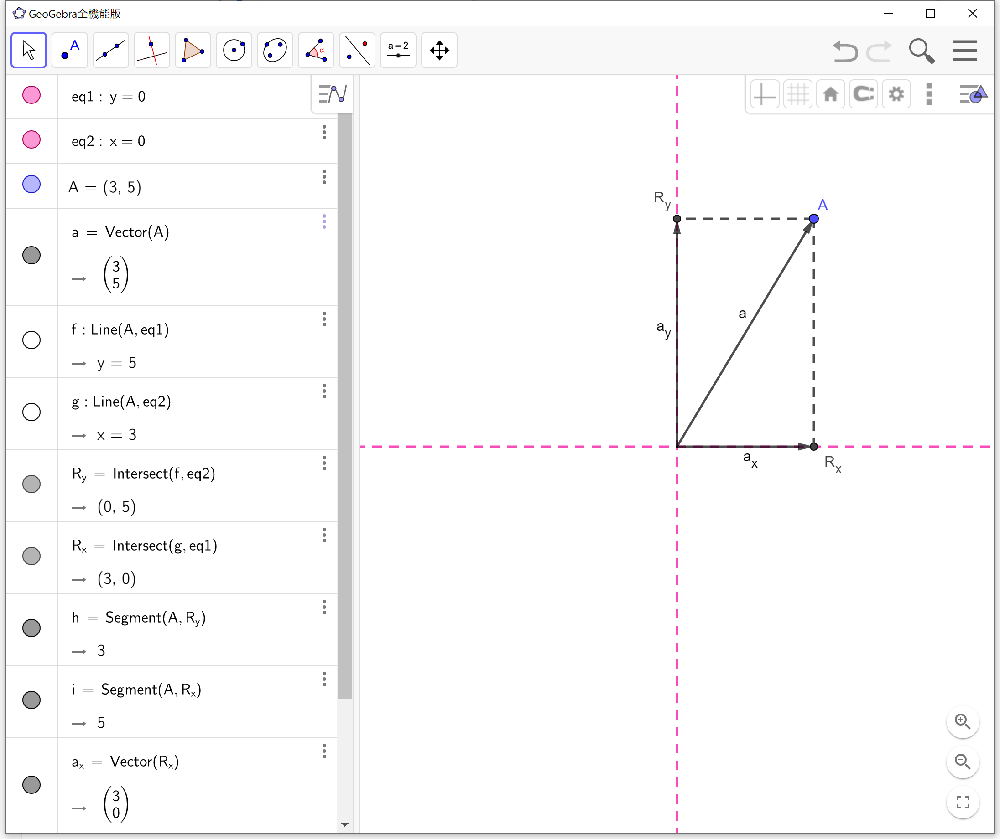

# Scienceで扱うベクトルの基本 #

　科学や，その一分野である物理を学ぶのに先だって，基本的なベクトルの取り扱いを修得するのは有意義である．理由はシンプルで，物理学ではベクトルで表される量を取り扱うことが多いからである．

## べクトルとは ##

　ベクトルは，向きを持つ量およびそれを表す方法である．よって **大きさ** と **向き** のセットで表される．これに対しスカラーは，大きさのみを持つ量である．よって **大きさ** のみによって表される．

物理量で扱うベクトル量，スカラー量の一部を以下に列挙する．

| ベクトル量                                                   | スカラー量                                                   |
| ------------------------------------------------------------ | ------------------------------------------------------------ |
| 力 $\overrightarrow{F}\;〔\mathrm{N}〕$ 位置 $\overrightarrow{s}, \overrightarrow{x}, \overrightarrow{y}\;〔\mathrm{m}〕$  速度 $\overrightarrow{v}$ 〔m/s〕 加速度 $\overrightarrow{a}$ 〔m/s〕 電場 $\overrightarrow{E}$ 〔V/m〕 | 質量 $m$ 〔kg〕 体積 $V$ 〔m3〕 長さ $s$ 〔m〕 速さ $v$ 〔m/s〕 温度 $T$ 〔K〕 電気量 $q$ 〔C〕 |

　例えば，部屋に置いてある箱を押して（＝力を加え，作用させて）動かそうと考えたとする．あなたは箱をどの方向へ動かしたいかを考えた上で，箱を押す向きを決めるだろう．例えば，道に迷ったときにスマートフォンの地図機能を利用する．地図アプリの上では自分の向いている方角が表示され，進む向きを決めることができる．つまりベクトル量は，向きが違えばそこにあるものや現象も異なる．

　それに対し，温度や質量に向きは無い．（質量は下向き？ それは大きな誤解だ．）長さや速さは，それらに対応するベクトルである位置や速度の絶対値（大きさ）を表す量である．

### まとめると ###

- 物理量にはベクトル量とスカラー量があるよ．
- ベクトルは向きを持つ量で，スカラーは向きを持たない量だよ．
- ベクトル量も，その大きさのみを表す場合があって，それはスカラー量として扱われるよ．

## ベクトルの表し方 ##

　図表において，ベクトルは矢印を使って表される．ベクトルの大きさによって矢印の長さを，ベクトルの向きによって矢印の向きを決める．あるベクトル $\overrightarrow{a}$ を図示すると，以下のようになる．

**※注意**：本来であれば，上図に示すベクトルの名前は a ではなく $\overrightarrow{a}$ とすべきところである．このように表現されてしまうのは，図表を作成しているGeogebraがそのように表記してしまうからである．ご容赦願いたい．また，以下の図表においても同様のことが起こっているので，注意されたし．

### ベクトルの始点について ###

　さて，もし中学校において力をベクトル（つまり矢印）で表すことを学んだのなら，以下のルールを習ったのではないだろうか．

1. 力の大きさ　は　矢印の長さ　で表す
2. 力の向き　は　矢印の向き　で表す
3. 力の作用点　を　矢印の始点　におく

　1および2については，ベクトルの表し方として示した通りである．だが，3についてはベクトルのルールと一致していない．これは，全ての幾何ベクトルに共通するルールを利用したではなく，力をベクトルで表す時の特殊ルールであると，頭の片隅に置いておくとよい．（この記法により，今のところ出番のない「力の作用点を表す位置ベクトル」を省略している．）

　つまり本来，ベクトルは長さと向きが同じであれば，どこに書いても同じことを表していることになる．一般的なベクトルのルールでは，必要に応じて長さと向きを維持したまま平行移動するのは構わないのである．

## ベクトルの基本的な計算 ##

　向きを持つ量であるベクトル量を計算する場合，幾何ベクトルの計算に従う必要がある．ベクトル同士の和や差を求める場合，図の上で求めたければ，合成や分解の作図をする．

### ベクトルの合成 ###

　例えば，$\overrightarrow{a}, \overrightarrow{b} $ が下図の黒矢印の通りにあるとき，  $\overrightarrow{a} + \overrightarrow{b}$ は赤矢印のように示される．

　ベクトルの和は，図の上で表現される．加算するそれぞれのベクトルをつなぎ合わせたり，平行四辺形の作図を行うことで，和ベクトルの終点を見つけることができる．

　また，同じ $\overrightarrow{a}, \overrightarrow{b} $ について，  $- \left( \overrightarrow{a}+\overrightarrow{b}\right)$ は，図において次のように表される．

さらに， $\overrightarrow{a}-\overrightarrow{b}$ は次のように表される．

### ベクトルの合成：アクティビティ

　実際に，コンピュータ上でベクトルを触ってみると，わかることがいろいろあるだろう．コロラド大学によるPhETと呼ばれる学習用シミュレーション群が存在するので，それを利用するとよいだろう．

https://phet.colorado.edu/ja/

URLからPhETのトップページに行き，カテゴリ「物理」→「運動」内の「ベクトル加算」シミュレーションを試してみよう．一応，直接のURLも示しておく．

https://phet.colorado.edu/ja/simulation/vector-addition

それと最後に，ベクトルとスカラーを足し合わせたり，引いたりはできないことを覚えておこう．（つまり， $\overrightarrow{a} + p$ というのは，あり得ない．）

### ベクトルの分解

　2つ以上のベクトルを1つに合わせるベクトルの合成に対し，1つのベクトルを2つやそれ以上に分解することもできる．下図は，あるあるベクトル $\overrightarrow{a}$ を，ある2軸（ピンク点線）に沿って分解したものである．

上に示した分解は，以下の手順で作図する．

1. ベクトルの終点から，与えられた2本の軸に**平行な補助線をそれぞれ引く**
2. 引いた補助線と与えられた軸との交点が2つできるので，そこを終点としたベクトルを新たに引く

である．**「垂線を下ろす」ではなく「平行線を引く」であることに注意**すること．2軸が平面上で直交していない場合についても，以下に示す．

　こうして作図された $\overrightarrow{a_x} , \overrightarrow{a_y}$ は，  $\overrightarrow{a} = \overrightarrow{a_x} + \overrightarrow{a_y}$ である．

### ベクトルとスカラーの積 

　ベクトルをスカラー倍することについては，一般的な計算のルールにとても近しい．あるベクトル $\overrightarrow{a}$ を決め，それに対して $3\overrightarrow{a}$ を図示すると下のようになる．

また， $-2\overrightarrow{a}$ は，以下の通りである．

ベクトルをスカラー倍する際には，向きは変わらず，大きさがスカラー倍される．

### まとめると

- ベクトルは合成したり分解したりできるよ．
- ベクトルの合成は，つなぎ合わせたり平行四辺形を作図することでできるよ．
- ベクトルの分解は，2つの軸を含めた平行四辺形を作図することでできるよ．
- これらを利用してベクトルの加算・減算ができるよ．
- ベクトルのスカラー倍は，ベクトルの大きさがスカラー倍されるよ．向きは変わらない．

## ところでこの文章はどうやって作ったのか

　テキストは，Typoraというソフトを使って書いています．Typoraはマークダウンエディタの一つで，お手軽に見栄えのよいwebページっぽいのが書けるのと，数式がLaTex記法できれいに書けるので，よく使っています．（もちろん，フォーマルな文書とかはWordなり何なりを使うよ．）

https://typora.io

　図は，Geogebraというソフトを使っています．これは是非とも使ってみてほしい．数学の問題を考えるときや，理科のレポートを書く時にも，役立つと思います．

https://www.geogebra.org/?lang=ja