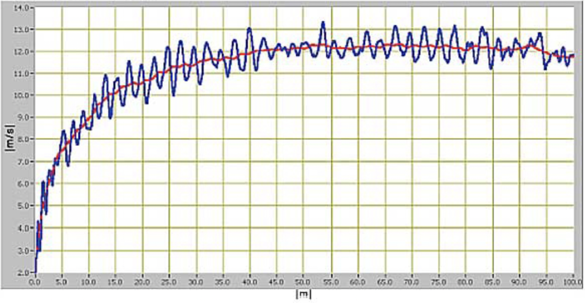

# 運動の基礎 〜位置・速度・加速度〜

ここでは、物体の運動を記述する基礎となる、位置・速度・加速度について簡単に取りまとめる。

## 復習　私たちが知っている「速さ」の計算

　ものの運動のようすを考える上で、「速さ」という量を利用するのは賢い方法である。私たちは速さを求めることで、全く異なる条件下の運動を比較することや、物体の未来のある時刻における位置を予測することができた。試しに以下の例題を解いてみよう。（答えはページ最後に掲載しておく。）

### 例題1．

以下に示す物体の運動を、速い順にならべよ。

- 2009年ベルリン世界陸上にて、100mを9秒58で走ったウサイン・ボルト
  https://www.worldathletics.org/records/all-time-toplists/sprints/100-metres/outdoor/men/senior
- 第42回鳥人間コンテスト2019にて、60kmに2時間36分で到達した渡邊 悠太
  https://www.dmgmori.co.jp/trend/detail/birdman2019.html
- マルエーフェリー「琉球エキスプレス3」東京〜沖縄間の走運行距離は1743km、かかる時間は50時間
  https://www.aline-ferry.com/tokyo/time/

### 例題2．

エアグライダーが秒速30mで滑空している。今から10秒後、エアグライダーは今いる場所からどのくらい移動しているか。

　さて、実は上記の計算は全て、その距離を走りきるまでの間、同じ速さであったと仮定していることに気付いているだろうか。上記で導出されたボルトの速さは「時速37.5km」すなわち秒速10.4mであったが、ボルトが実際にその速さで走っていたのはごく短い間であることが、以下のグラフからも明らかであろう。

世界陸上2009におけるウサインボルト 9.58 WR時の $v-t$ グラフ

Rolf Graubner et al. IAAF 26:1/2; 19-53, 2011

しかし、このような計算が有用であることも間違いない。物理学を学習するならば、この計算で求めていたものが何なのかをきちんと理解し、説明できるようにする必要がある。

## 位置を定義する

私たちは、空間上の一点を座標で表現できることを知っている。これを利用して、物体の位置を表すことができる。

位置を座標として取り扱ってもよいが、位置ベクトルとして表現する方法もある。この方が、数学的にはすっきりする。（変位がベクトル同士の差で示されるし、ベクトルの長さによって原点からの距離が示される。）今のところは、ただの好みの問題なので、好きな方でイメージしておけばよい。

さて、これで物理における「位置」という量を理解したつもりになるのは、よくない。こういうのを机上の空論という。実際にある物体の位置を、この方法で表現できるだろうか。机の上にいくつかのおはじきが散らばっている。

これを位置座標や位置ベクトルで示そうとするなら、基準となる原点や、軸の向きを私たちが決めないといけない。

このような、原点の決定（例：$ t=0 $ における物体Aの位置をを原点とすると……）、軸の決定（例：台車の進む向きをx軸の正の向きとすると……）はこれから力学の問題を解くたびにやることになるし、ここを曖昧にすると危険である。

## 速度を定義する

物体の運動を表すパラメータとして、速度を導入しよう。速度を定義するためには、変位、時刻、経過時間を定義し、そこから導出する必要がある。

### 変位を定義する

2点間を移動したときの、位置の変化を変位という。これは長さの次元を持つベクトル量である。例えば、 $ x_1 $ にあった物体が $ x_2 $ まで移動したとき、変位 $ \Delta x $ は、 

$$
\overrightarrow{\Delta x}=\overrightarrow{x_2}-\overrightarrow{x_1} \tag{1}
$$

である。直線上の運動を、ある方向を正として表現するならば、ベクトルはスカラーとして表現でき、

$$
\Delta x = x_2-x_1 \tag{2}
$$

と表せる。とりあえず今は、直線上の運動について考えることにしよう。

### 時刻・経過時間を定義する

ある適当な時刻を $t=0$ とし、上記の物体が、 $x_1$ を出発した時刻を $t_1$ 、 $x_2$ に到達した時刻を $t_2$ としよう。この時、経過した時間は

$$
\Delta t = t_2-t_1 \tag{3}
$$

と表せる。位置を示すときに基準となる原点を設定したように、ある時刻を $t=0$ とすることで、問題となっている時刻を示すことができるようになる。そして、その差として経過時間を表せる。

### 平均の速度を定義する

物体が、時間 $\Delta t$ の間に $\Delta x$ だけ移動した時、単位時間あたりの変位 $\bar{v}$ は、

$$
\bar{v}=\frac{\Delta x}{\Delta t} \tag{4}
$$

で表せる。(2)式や(3)式を代入すると、

$$
\bar{v}=\frac{\Delta x}{\Delta v}=\frac{x_2-x_1}{t_2-t_1} \tag{5}
$$

であることがわかるだろう。この単位時間あたりの変位 $\bar{v}$ を平均の速度という。

さて、これは変位や速度がベクトルであるということを除けば、私たちが従来からやっていた速さの計算と同じである。つまり、

$$
(速さ)＝\frac{(距離)}{(時間)}
$$

は、(4)式の変位 $\Delta x$ を距離に、 $\bar{v}$ を速さにおきかえただけのもので、本質的には同じようなことをやっている。

